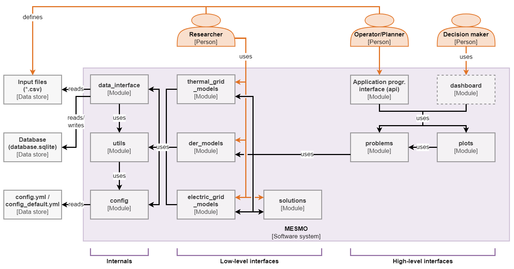
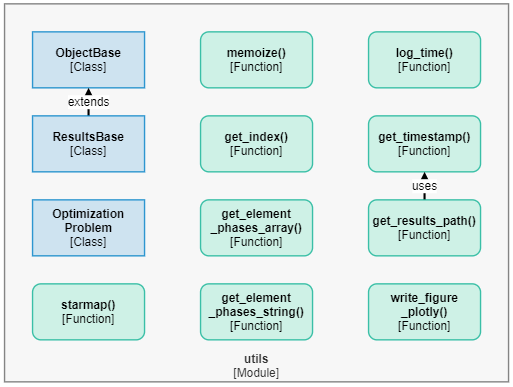
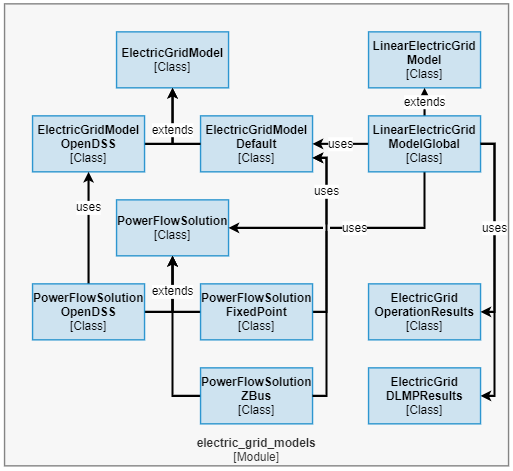
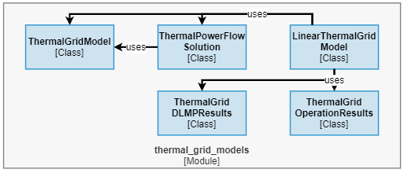
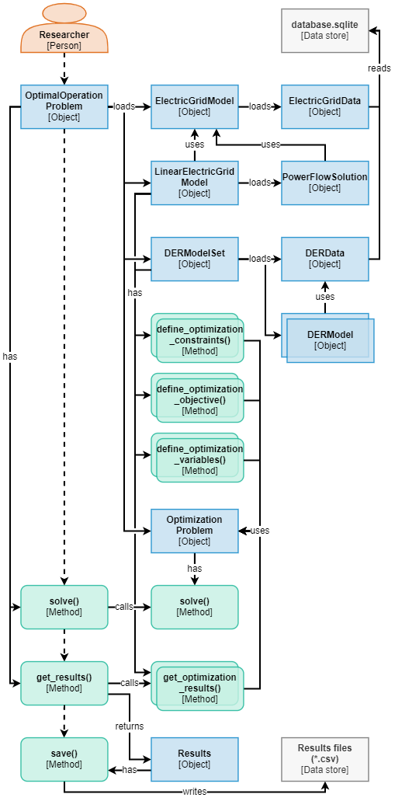
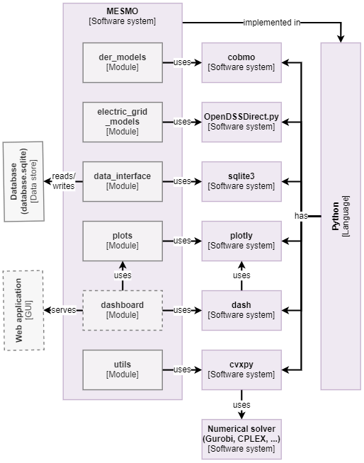

# Architecture

## Overview

The following sections define the software architecture for MESMO through views of key software structures:

- [Module structures](#module-structures) describe the decomposition of the software into data containers, modules, classes and functions.
- [Workflow structures](#workflow-structures) characterize how different modules interact with one another during run time.
- [Allocation structures](#allocation-structures) define how the module structure is reflected in the file structure of the source code and how the development tasks are organized.

The [appendix section](#appendix) contains supplementary information on the requirements development process that has led to the initial software architecture for MESMO:

- [Use case modeling](#use-case-modeling) captures fundamental information needed to analyze and define functional requirements.
- [Functional requirements](#functional-requirements) define the expected concrete functionality of the software.
- [Quality attributes](#quality-attributes) set out the expected performance characteristics of the software.

### Structures and views

The notation for [module structures](#module-structures), [workflow structures](#workflow-structures) and [allocation structures](#allocation-structures) is based on the [C4 model](https://c4model.com/). Although its notation is traditionally intended for views of the module structure, the C4 model is also utilized in the workflow and allocation structures for a more consistent representation of individual elements across the different views.

The [module structures](#module-structures) are first introduced from a high level in the context view, which is followed by a comprehensive overview in the component view. Then, the individual modules are introduced though their respective code views. Note that code views of the `plots` and `dashboard` modules are omitted in the following because the concrete functionality has not been finalized. Similarly, the planning problem is currently not included in software architecture because this problem type has not yet been implemented in MESMO.

The module structures are followed by the [workflow structures](#workflow-structures) for the exemplary nominal and optimal operation problems. The purpose of the workflow structures is to provide an understanding of the data and run-time event flow when executing a problem. This also serves as a template for user-developed custom workflows which utilize low-level module interfaces. Lastly, the [allocation structures](#allocation-structures) present an overview of the dependency, repository and branch structures, relevant to any developers contributing to MESMO. For the dependency structure, the container view of the [C4 model](https://c4model.com/) is utilized.

### Stakeholders

The following stakeholders are used to differentiate the intended ways of interacting with MESMO for specific types of users. This is in line with the "actors" defined in the [use case modeling](#use-case-modeling):

- The **system operator** is responsible for maintaining and operating the district-scale energy system. This stakeholder is interested in modeling and optimizing short-term to medium-term dispatch decisions.
- The **system planner** looks at the long-term operation and upgrading of the district-scale energy system. This stakeholder seeks to model future developments and optimizing long-term investment decisions.
- The **decision-maker**, e.g. policy maker or utility executive, takes responsibility for the strategic development of the district-scale energy system. This stakeholder is primarily interested in evaluating results prepared by other stakeholders.
- The **researcher** works on research and development tasks in the context of district-scale energy systems, e.g. investigation of novel operation strategies. To this end, the researcher is associated with the most diverse set of use cases.

## Module structures

### Context view

(fig:architecture_overview)=

**Context view of MESMO.**

[The context view](fig:architecture_overview) depicts a high-level overview of the most critical components and the interaction between the software system and its stakeholders. The user interfaces can be distinguished into high-level interfaces, i.e. the `api` module and the `dashboard` module, and low-level interfaces, i.e. the `models` modules. To this end, the `api` module and `models` modules describe programming interfaces, whereas the `dashboard` denotes the GUI. Researchers primarily interface MESMO directly through the `models` modules because they require highly granular access and modifiability of the model objects for custom workflows. System planners and system operators interface MESMO through the `api` module, which provides convenient access to the most common workflows, i.e. running nominal and optimal operation problems and producing results plots. Decision-makers interface MESMO through the GUI of the `dashboard` module. Note that the `dashboard` module has not yet been implemented.

Scenario and model data definitions are enabled through a standardized [CSV-based input file format](data_reference.md), which is referred to in the [context view](fig:architecture_overview) as “Input files (\*.csv)”. The input files are expected to be defined by researchers, system planners and system operators. Decision-makers are expected to rely on other stakeholders to define appropriate scenarios for their review.

Internally, the `api` module implements API functions which rely on the `problem` module and `plots` module. The `dashboard` module implements the GUI framework but relies on the `plots` module to generate individual plots. The `problems` module implements the main workflows for setup and solution of different problem types, for which it uses the mathematical models defined in the `models` modules. The `problems` module also implements a standardized results object across all problem types, which is used by the `plots` module. The `models` modules further rely on the `data_interface` module to obtain the model data definitions from the input files.

### Component view

(fig:architecture_overview_detailed)=

**Component view of MESMO.**

The [component view of MESMO](fig:architecture_overview_detailed) provides a complete overview of all components, i.e. modules and data stores, of MESMO. The interaction between stakeholders and the software system follows the structure that has been outlined in [the context view](fig:architecture_overview) and is not repeated here. Compared to [the context view](fig:architecture_overview), the `models` modules are represented individually in [the component view](fig:architecture_overview_detailed) as `der_models` module, `electric_grid_models` module and `thermal_grid_models` module. Further, the `problems` module, `plots` module and `models` modules all use the `utils` module, which implements auxiliary functionality, such as base classes and logging functions. Researchers may use the `OptimizationProblem` class and results-path creation function from the `utils` module for creating custom workflows and optimization problem definitions.

In addition to the above described functionality, `data_interface` module creates an internal database, i.e. `database.sqlite`, which serves as a temporary data store for scenario and model data. The internal database enables the utilization of SQL statements for efficiently transforming the input data into model data objects, which are then used by the `models` modules. The `config` module facilitates the declaration of configuration parameters, e.g. the level of logging outputs or the choice of optimization solvers. It is used by the `data_interface` module, `utils` module, `problems` module, `plots` module and `models` modules. The `config` module reads configuration parameter definitions from the data stores `config.yml` and `config_default.yml` in [YAML format](https://yaml.org/).

MESMO is intended as a software system that is deployed to individual workstations akin to a traditional desktop application, where all data and dependencies are kept local. Nevertheless, the software architecture is kept flexible enough to support alternative deployment structures in future, e.g. provisioning of a remote database system for the internal data store or operating MESMO as a server-side system that serves a web-based dashboard.

### Configuration module

(fig:architecture_config)=

**Code view of the configuration module.**

The `config` module implements the following functionality:

- Declaration of configuration variables in `get_config()`.
- Setup of logger object in `get_logger()`.
- Setup of parallel pool in `get_parallel_pool()`.

The `get_config()` function is executed upon initialization of the `config` module and sets the `config` dictionary, which is available as public global variable for all modules of MESMO. The `config` dictionary encapsulates configuration parameters, such as logging level and optimization solver selection. The configuration parameters themselves are defined in the data stores `config.yml` and `config_default.yml`, where `get_config()` first reads the latter to obtain the default settings and then `config.yml` for user-defined configuration parameters which supersede the default settings.

The setup of logger objects is handled by `get_logger()`, where all other modules of MESMO instantiate a local logger object through `get_logger()` upon their initialization. The logger object itself is implemented in [`logging.Logger`](https://docs.python.org/3/library/logging.html#logger-objects) of the Python standard library. However, `get_logger()` takes care of setting the logging level according to the configuration settings.

The function `get_parallel_pool()` is used by `starmap()` from the `utils` module to instantiate a parallel pool upon first use. A handle to the parallel pool object is then set to the global variable `parallel_pool`. The usage of parallel processing is controlled through a configuration parameter.

Aside from the functionality mentioned above, the `config` module also defines run-time settings for various Python modules upon initialization. For example, default settings for the `pandas` and `plotly` libraries are set here.

### Utility module

(fig:architecture_utils)=

**Code view of the utility module.**

The `utils` module implements the following functionality:

- MESMO object base class in `ObjectBase`.
- Results object base class in `ResultsBase`.
- Optimization problem class in `OptimizationProblem`.
- Parallelization utility function in `starmap()`.
- Indexing utility functions in `get_index()`, `get_element_phases_array()` and `get_element_phases_string()`.
- Utility functions to capture and log elapsed time in `log_time()`.
- Helper functions to create and return a current time stamp in `get_timestamp` and a path for a new results folder in `get_results_path()`.
- A utility function for writing `plotly` figures to files in `write_figure_plotly()`.
- Other utility functions, which have yet to be included here (see [API reference](api_reference.md) for more).

The `utils` module essentially provides support functionality for the other modules of MESMO. To begin, the `ObjectBase`, `ResultsBase` and `OptimizationProblem` define base classes for MESMO, such that common functionality is not multiply defined in the model modules. Note that the purpose and functionality of the {class}`mesmo.solutions.OptimizationProblem` object is extensively documented in the [API reference](api_reference.md).

The `starmap()` function enables the parallelization of function calls, such that independent function can be executed in parallel, e.g. the initialization of multiple models. Therefore, `starmap()` replaces for-loop instances, which is modeled on [`itertools.starmap()`](https://docs.python.org/library/itertools.html#itertools.starmap) from the Python standard library. Note that parallel processing via `starmap()` must be explicitly enabled through the [multiprocessing configuration parameters](configuration_reference.md#multiprocessing-configuration). The `starmap()` function enables performance improvements to address the solution time software quality attribute.

The `get_index()`, `get_element_phases_array()` and `get_element_phases_string()` functions define low-level functionality to support convenient indexing into vectors and matrices of the mathematical model formulations. This is heavily utilized in the model modules.

The `log_time()` function enables time-based logging of function executions, which is mainly utilized in the `problems` module. This function is aimed at improving the testability of MESMO. Lastly, the `get_timestamp`, `get_results_path()` and `write_figure_plotly()` are helper functions that support the output of results.

### Data interface module

(fig:architecture_data_interface)=

**Code view of the data interface module.**

The `data_interface` module implements the following functionality:

- Function to connect to the internal database in `connect_database()`.
- Function to create or clear the internal database and reload all data from the input files in CSV format in `recreate_database()`.
- Data container objects for scenario data in `ScenarioData`, price data in `PriceData`, DER data in `DERData`, electric grid data in `ElectricGridData` and thermal grid data in `ThermalGridData`.

The primary purpose of `data_interface` module is to address the software quality attributes regarding interoperability and modifiability. To this end, the data container objects of this module serve as an abstraction layer between external and internal data structures. More specifically, internal model objects, e.g. `ElectricGridModel`, rely exclusively on data container objects, e.g. `ElectricGridData`, for their model parameter input but do not read any external data definitions directly. This is leans on the “clean architecture” principle from (Martin 2018, p. 195, Chapter 22), which suggests that software layers that implement core functionality, i.e. models modules, should not need to know anything about the external interfaces of the software system, i.e. the input data definitions. This approach supports interoperability and modifability because changes to the external data formats of MESMO do not induce any changes in the model implementations. Note however, that changes on the model implementations may indeed require changes to the data interface, as the required model parameters may change.

The `connect_database()` function establishes the connection to the internal database and returns a connection handle. MESMO utilizes an SQLITE database as internal database, which is stored locally as `database.sqlite`. On the other hand, if the local database does not yet exist, it is created through a call to `recreate_database()`. This function creates an empty database and loads the CSV input files into the database. If the local database exists, a call to `recreate_database()` clears the existing database before parsing the CSV input files. The MESMO CSV input format is aligned with the internal database schema, such that each CSV file corresponds to a table in the SQL database. Therefore, the CSV file name is interpreted as table name and the values in the first row are interpreted as column names. Note that MESMO can in principle be adapted to use other SQL database software than SQLITE, through modification of `connect_database()` and `recreate_database()`.

The data container objects, i.e. `ScenarioData`, `PriceData`, `DERData`, `ElectricGridData` and `ThermalGridData`, implement routines for selecting and transforming data from the database into a suitable format for the model input. To this end, the data containers encapsulate only the relevant data items for the corresponding model class and the current scenario. The `DERData`, `ElectricGridData` and `ThermalGridData` objects contain model parameters for the namesake model classes. The `PriceData` contains the set of price time series for the current scenario. The `ScenarioData` object contains scenario information, such as the set of time steps and general parameters of the current scenario. Note that other data objects use the `ScenarioData` object, e.g. to obtain the set of time steps for resampling time series data.

### Electric grid models module

(fig:architecture_electric_grid_models)=

**Code view of the electric grid models module.**

The `electric_grid_models` module implements the following functionality:

- Fundamental electric grid models in `ElectricGridModel`, `ElectricGridModelDefault` and `ElectricGridModelOpenDSS`.
- Power flow solution algorithms in `PowerFlowSolution`, `PowerFlowSolutionFixedPoint`, `PowerFlowSolutionZBus` and `PowerFlowSolutionOpenDSS`.
- Linear electric grid models in `LinearElectricGridModel`, `LinearElectricGridModelSet`, `LinearElectricGridModelGlobal` and `LinearElectricGridModelLocal`.
- Electric grid operation problem results in `ElectricGridOperationResults` and `ElectricGridDLMPResults`.

The `ElectricGridModel` class implements a base class for electric models, which consists of index sets for nodes, branches and DERs and reference vectors for the nodal voltage, branch power flow and DER power injection / load. This base class is extended in `ElectricGridModelDefault` with the mathematical definitions of the fundamental electric grid model. To this end, the model implements nodal and branch admittance matrices along with branch and DER mapping matrices. The `ElectricGridModelOpenDSS` similarly extends the `ElectricGridModel` class, where the focus lies on implementing a OpenDSS model based for the provided grid definition data. This essentially acts as an interface to OpenDSS, which is provided in MESMO to allow for benchmarking of obtained power flow solutions. The implementation relies on [`OpenDSSDirect.py`](https://github.com/dss-extensions/OpenDSSDirect.py), which provides a Python interface and command-line executables of OpenDSS.

The `PowerFlowSolution` class implements a abstract base class for power flow solutions, thereby declaring the expected output variables of the power flow solution. This base class is extended in `PowerFlowSolutionFixedPoint` for the fixed-point solution algorithm and in `PowerFlowSolutionZBus` for the Z-bus solution algorithm, which both use and `ElectricGridModelDefault` object as an input for the power flow solution. The `PowerFlowSolutionOpenDSS` class implements a power flow solution through OpenDSS, where it relies on an OpenDSS model being defined in `ElectricGridModelOpenDSS`.

The `LinearElectricGridModel` class implements a base class for linear electric model, where the expected sensitivity matrices of the linear grid model are declared. Based on a set of `LinearElectricGridModel` objects, i.e. one model per time step, the `LinearElectricGridModelSet` class implements the optimization-related methods `define_optimization_variables`, `define_optimization_constraints` and `define_optimization_objective` to define variables, constraints and objective for an optimal operation problem based on the linear grid model. Further, this class implements `get_optimization_results` and `get_optimization_dlmps` to obtain the DLMPs and other results after the optimization problem was solved. The `LinearElectricGridModel` base class is extended in `LinearElectricGridModelGlobal` and `LinearElectricGridModelLocal` with the mathematical definitions for the sensitivity matrices based on the global and local approximation methods.

The results container classes `ElectricGridOperationResults` and `ElectricGridDLMPResults` encapsulate the output from `get_optimization_results` and `get_optimization_dlmps`. To this end, the container classes declare a standardized interface for results data. This addresses the software quality attribute for modifiability, since it ensures a decoupling of the mathematical model implementation from the post-processing functionality in the `plots` and `dashboard` modules.

### Thermal grid models module

(fig:architecture_thermal_grid_models)=

**Code view of the thermal grid models module.**

The `thermal_grid_models` module implements the following functionality:

- Fundamental thermal grid model in `ThermalGridModel`.
- Thermal power flow solution algorithm in `ThermalPowerFlowSolution`.
- Linear thermal grid models in `LinearThermalGridModel` and `LinearThermalGridModelSet`.
- Thermal grid operation problem results in `ThermalGridOperationResults` and `ThermalGridDLMPResults`.

The `ThermalGridModel` class implements the fundamental thermal grid model consisting of index sets for nodes, branches and DERs in the thermal grid as well as branch parameter and mapping matrices. Based on this, the `ThermalPowerFlowSolution` implements the thermal power flow solution algorithm for the thermal grid. Note that the distinction into base classes and detail classes is omitted due to lack of differentiation the thermal grid models but a structure similar to the `electric_grid_models` module may be introduced at later point.

The `LinearThermalGridModel` class implements base for linear thermal grid models, where the expected sensitivity matrices of the linear grid model are declared and defined. Based on a set of `LinearThermalGridModel` objects, i.e. one model per time step, the `LinearThermalGridModelSet` class defines the optimization-related methods `define_optimization_variables`, `define_optimization_constraints` and `define_optimization_objective` to define variables, constraints and objective for an optimal operation problem based on the linear grid model. Further, this class implements `get_optimization_results` and `get_optimization_dlmps` to obtain the DLMPs and other results after the optimization problem was solved.

The results container classes `ThermalGridOperationResults` and `ThermalGridDLMPResults` encapsulate the output from `get_optimization_results` and `get_optimization_dlmps`. To this end, the container classes declare a standardized interface for results data. Similar to the results classes in the `electric_grid_models` module, this addresses the software quality attribute for modifiability.

### DER models module

(fig:architecture_der_models)=

**Code view of the DER models module.**

The `der_models` module implements the following functionality:

- Fundamental DER models in `DERModel`, `FixedDERModel` and `FlexibleDERModel`.
- Various fixed DER models in `FixedLoadModel`, `FixedGeneratorModel`, `FixedEVChargerModel`.
- Various flexible DER models in `FlexibleLoadModel`, `FlexibleGeneratorModel`, `StorageModel`, `CoolingPlantModel`, `HeatingPlantModel`, `FlexibleBuildingModel`.
- DER model set in `DERModelSet`.
- DER operation problem results in `DERModelSetOperationResults`.
- Factory function for DER model objects in `make_der_model()`.

The `DERModel` class serves as an abstract base class for DER models, which declares fundamentally expected model variables, such as nominal power time series or grid connection indicators. The classes `FixedDERModel` and `FlexibleDERModel` are abstract base classes that extend `DERModel` with variable declarations that are distinct for fixed or flexible DER models. These classes also implement the methods `define_optimization_variables`, `define_optimization_constraints` and `define_optimization_objective` to define variables, constraints and objective for an optimal operation problem based on the linear grid model. Further, the base classes implement `get_optimization_results` to obtain the results after the optimization problem was solved.

The concrete mathematical model definitions for fixed DER models are implemented in `FixedLoadModel`, `FixedGeneratorModel`, `FixedEVChargerModel`, which respectively extend `FixedDERModel`. The corresponding model definitions for flexible DER models are implemented in `FlexibleLoadModel`, `FlexibleGeneratorModel`, `StorageModel`, `CoolingPlantModel`, `HeatingPlantModel`, `FlexibleBuildingModel`, which respectively extend `FixedDERModel`. Note that this listing represents the currently implemented DER models but MESMO may be augmented with other model types in the future. To this end, the definition of base classes in `DERModel`, `FixedDERModel` and `FlexibleDERModel` addresses the modifiability software quality attribute, as it defines a standardized interface for custom DER model implementations.

The class `DERModelSet` implements a container class for all DER models of a MESMO scenario. To this end, all DER models of a MESMO scenario are loaded upon initialization of the `DERModelSet`. Further, the class implements wrapper methods for `define_optimization_variables`, `define_optimization_constraints`, `define_optimization_objective` and `get_optimization_results`. This class relies on the factory function `make_der_model()` to create the relevant DER models. Note that the DER initialization is parallelized through `starmap()` from the `utils` module.

### Problems module

(fig:architecture_problems)=

**Code view of the problems module.**

The `problems` module implements the following functionality:

- Nominal operation problem in `NominalOperationProblem`.
- Optimal operation problem in `OptimalOperationProblem`.
- Results container class in `Results`.

The classes `NominalOperationProblem` and `OptimalOperationProblem` define the setup workflow for nominal and optimal operation problems. Further, these classes implement the methods `solve()` for solving the problem and `get_results()` for obtaining the solutions. The concrete workflow structures for nominal and optimal operation problems are highlighted below in .

The results container class `Results` declares the expected results variables for operation problems. To this end, this class inherits from the individual model results classes `ElectricGridOperationResults`, `ElectricGridDLMPResults`, `ThermalGridOperationResults`, `ThermalGridDLMPResults` and `DERModelSetOperationResults`. As discussed for the results classes in the `electric_grid_models` module, this addresses the software quality attribute for modifiability.

## Workflow structures

### Nominal operation problem

(fig:workflow_nominal_operation)=

**Workflow diagram of the nominal operation problems.**

The nominal operation problem is a simulation problem of the electric grid, thermal grid and DERs. The [workflow diagram](fig:workflow_nominal_operation) for an exemplary nominal operation problem is depicted above. In this example, the thermal grid is not considered for the sake of brevity. For the purpose of this documentation, the researcher is assumed to control the workflow within a read-eval-print loop (REPL), i.e. successively executing statements in the command line.

The workflow begins with the researcher creating an object of the `NominalOperationProblem` class. In the initialization routine of this object, the child objects `ElectricGridModel` and `DERModelSet` are created. In turn, the initialization routine of `ElectricGridModel` loads an `ElectricGridData` object, whereas `DERModelSet` loads an `DERData` object. The data objects respectively establish a connection to `database.sqlite` through `connect_database()` and then obtain the relevant data items. In `ElectricGridModel`, the index sets and model matrices are then defined based on the obtained data. In `DERModelSet` all DER models for the current scenario are created through `make_der_model()`, thereby loading multiple `DERModel` objects. Once the initialization routine is completed, control is returned to the researcher.

The researcher then calls the `solve()` method of the `NominalOperationProblem` object. This method first obtains the nominal power time series for each DER in the `DERModelSet`. Then, based on the DER nominal power vector for each time step as well as the `ElectricGridModel`, the `solve()` method obtains a `PowerFlowSolution` for each time step. Internally, this is handled through the `starmap()` function, as the power flow solution for each time step can be calculated independently and thus in parallel. The power flow solutions are stored within the `NominalOperationProblem` object and then control returned to the researcher.

Next, the researcher calls the `get_results()` method of the `NominalOperationProblem` object. This method transforms the results from the `PowerFlowSolution` objects into the results variables expected in the `Results` object, which is then created by passing the relevant variables into the container. Eventually, the `get_results()` method returns the `Results` object to the researcher.

In the last step, the researcher may save the results to the file system through the `save()` method of the `Results` object.

### Optimal operation problem

(fig:workflow_optimal_operation)=

**Workflow diagram of the optimal operation problems.**

The optimal operation problem is a numerical optimization problem of the district-scale electric grid, thermal grid and DERs. The [workflow diagram](fig:workflow_optimal_operation) for an exemplary nominal operation problem is depicted above. Similar to the nominal operation problem workflow above, the thermal grid is not considered for the sake of brevity and the researcher is assumed to control the workflow within a read-eval-print loop (REPL), i.e. successively executing statements in the command line.

The researcher begins the workflow by creating an object of the `OptimalOperationProblem` class. In its initialization routine, the `OptimalOperationProblem` creates child objects of the `ElectricGridModel`, `LinearElectricGridModelSet` and `DERModelSet` classes. To begin, the `ElectricGridModel` loads an `ElectricGridData` object, which establishes a connection to `database.sqlite` through `connect_database()` and obtains the relevant data items. In `ElectricGridModel`, the index sets and model matrices are then defined based on the obtained data. Based on this, the `LinearElectricGridModelSet` is instantiated, which internally loads a set of `LinearElectricGridModel` objects based on the index sets and model matrices of the `ElectricGridModel` object. Furthermore, a `PowerFlowSolution` object is loaded for the nominal loading conditions of the electric grid, which is required as a reference point for the global approximation method. Note that `LinearElectricGridModelSet` creates one `LinearElectricGridModel` for each time step of the scenario, which is intended to enable better solution quality by using individual approximation points, i.e. `PowerFlowSolution` objects, for each time step. This currently not utilized in `OptimalOperationProblem`, but the interface has been designed to be future-proof, e.g. for integration of a trust-region algorithm to iteratively update the approximation points. Lastly, in `DERModelSet` all DER models for the current scenario are created through `make_der_model()`, thereby loading multiple `DERModel` objects.

Furthermore, the initialization routine of the `OptimalOperationProblem` creates an object of the `OptimizationProblem` class. This object serves as a container for the mathematical definitions of the numerical optimization problem, i.e. its variables, constraints and objective definition. To this end, the `OptimizationProblem` class provides the necessary abstractions to enable a solver-agnostic problem definition (see {class}`mesmo.solutions.OptimizationProblem`). Continuing, the initialization routine of the `OptimalOperationProblem` defines the variables, constraints and objectives of the optimal operation problems. In this regard, the architecture of MESMO is structured such that variables, constraints and objective are implemented through methods within the `LinearElectricGridModelSet` and `DERModelSet` classes. This addresses the quality attributes for modifiability and modularity of the software. It ensures that 1) model interface changes are kept coherent with the optimization problem definitions and 2) variables, constraints and objective definitions can be obtained for each model individually. Therefore, the `OptimalOperationProblem` iterates through the methods `define_optimization_variables()`, `define_optimization_constraints()` and `define_optimization_objective()` of `LinearElectricGridModelSet` and `DERModelSet`, where the `OptimizationProblem` object is passed to each method in order to attach the variables, constraints and objective definitions. Once the initialization routine is completed, control is returned to the researcher.

The researcher then calls the `solve()` method of the `OptimalOperationProblem` object. This method calls the `solve()` method of the `OptimizationProblem` object, which in turn passes the optimization problem definition to the solver interface. It invokes the external optimization solver to obtain the solution.

Next, the researcher calls the `get_results()` method of the `OptimalOperationProblem` object. This method obtains the results for all model variables by invoking the `get_optimization_results()` methods of the `LinearElectricGridModelSet` and `DERModelSet`. The results are then transformed into the results variable structures which are expected in the `Results` object, which is then created by passing the relevant variables into the container. Eventually, the `get_results()` method returns the `Results` object to the researcher.

## Allocation structures

### Dependencies

(fig:architecture_container_view)=

**Container view of MESMO, highlighting the external software dependencies.**

The [container view](fig:architecture_container_view) highlights the main dependencies of the current implementation of MESMO. The primary programming language of MESMO is Python, such that all modules in the [context view](fig:architecture_overview_detailed) are implemented in this language. The further dependencies of MESMO are all Python packages, which ensures straightforward dependency management through the Python setup and package management facilities. On the modeling side, MESMO utilizes the `cobmo` and `OpenDSSDirect.py`, where `cobmo` implements the underlying mathematical models for `FlexibleBuildingModel` and `OpenDSSDirect.py` serves as an interface to OpenDSS in `ElectricGridModelOpenDSS` as well as `PowerFlowSolutionOpenDSS`. The `sqlite3` provides low-level interfaces for interacting with the internal SQLITE database, i.e. `database.sqlite`. The packages `plotly` and `dash` provide plotting and dashboarding functionalities, where `dash` will serve the future implementation of a web-based GUI out of MESMO. The [`cvxpy`](https://www.cvxpy.org/) package implements a convex optimization problem modeling framework and interfaces to various open-source and commercial solvers. In addition to using `cvxpy` as a generalized solver interface, MESMO also utilizes `gurobipy` to directly interface Gurobi in order to achieve performance improvements for large scenarios. Further direct solver interfaces are intended to be added on an as-need basis.

### Repository structure

(fig:architecture_repository_structure)=

**Repository structure of MESMO.**

MESMO is intended as a software system that is deployed to individual workstations akin to a traditional desktop application, where all data and dependencies are kept local. In line with this, the components of MESMO are fully contained within a single software repository. The repository structure, i.e. file structure, of MESMO follows the recommended Python package structure from (Reitz and Schlusser 2016) as depicted [above](fig:architecture_repository_structure). The repository is implemented as a [Git repository](https://git-scm.com/) for version control and is hosted at [GitHub](https://github.com/mesmo-dev/mesmo).

The main code base of the MESMO Python package is contained within the `mesmo` directory. The file `__init__.py` simply contains import statements for the individual modules, such that all modules are loaded when importing MESMO. The remaining Python files in the `mesmo` directory represent the modules from [the component view](fig:architecture_overview_detailed), where Python interprets the file names as module names. Additionally, this directory contains the default configuration parameters in `config_default.yml` and the `database_schema.sql` file, which contains declarations for the data-structure of the internal SQL database, i.e. `database.sqlite`. In principle, the `mesmo` directory only contains code and declarative information but strictly no scenario or model data definitions or custom execution scripts.

The scenario and model data are contained within the `data` directory. This directory consists of CSV files in [MESMO data format](data_reference.md), which define example test case scenario data. The CSV files are organized into sub-directories for the individual test cases. The `data` directory further contains the `database.sqlite` file for the internal database in SQLITE format, which is created locally upon first run of MESMO and initially will contain the example test case definitions from the CSV files.

The `docs` directory contains the software documentation for MESMO, which is based on the [Sphinx documentation builder](https://github.com/sphinx-doc/sphinx). The directory contains markdown (MD) files for each section of the documentation and Sphinx configuration files and other assets of the documentation. The documentation is [automatically built](https://github.com/mesmo-dev/mesmo/actions/workflows/documentation.yml) via [GitHub Actions](https://github.com/features/actions) and deployed to [GitHub Pages](https://pages.github.com/) whenever changes are pushed to the repository. Consequently, the documentation is made available for users online in HTML format.

The `examples` directory contains example run scripts, which demonstrate typical use cases of MESMO. This directory and online documentation are intended as the main entry point for new users. Therefore, these examples are highly commented and serve as templates for custom applications utilizing the MESMO high-level and low-level interfaces. For developers, the `examples` directory contains a `development` sub-directory intended for work-in-progress scripts relating to the implementation of new features in MESMO.

Results data items of an example run scripts are by default stored into the `results` directory. This directory is provided for convenience to keep all MESMO-related data within a single location. The Git repository is configured to ignore any files in this directory, such that results are local-only and are not committed to the main repository.

The `test` directory contains unit tests for the classes and functions of all modules. Although MESMO does not strictly follow test-driven development, unit tests are an important tool for collaborative development because they help reveal if code changes impact other functionalities in unexpected. To this end, the `test` directory contains one unit test script for each module of MESMO. The unit tests are automatically executed through GitHub Actions whenever changes are pushed to the repository and alerts to developers are triggered on test failures.

The aforementioned automations with GitHub Actions for documentation and tests are configured in the `.github` directory. In addition, the `workflows` sub-directory contains one YAML file in GitHub Actions format for each automation workflow.

The top-level repository folder contains several configuration and supplementary files. The file `config.yml` is the counterpart of `config_default.yml` and contains custom user-defined configuration parameters. This file is intended for local changes to the MESMO configuration. e.g. choice of optimization solver, and the Git repository is configured to ignore this file, such that it is not committed to the main repository. Finally, the file `setup.py` defines installation routines and external package dependencies of MESMO, including references to the dependencies from [the container view](fig:architecture_container_view).

The CoBMo toolbox is included as a [Git submodule](https://git-scm.com/docs/gitsubmodules) in the `cobmo` directory. This approach is chosen to allow for integrated development of CoBMo alongside MESMO. CoBMo also has not been released to any Python package index and thus could not integrated through `setup.py` as another external dependency.

A few top-level files have been excluded in [the repository structure view](fig:architecture_repository_structure) for the sake of brevity: `README.md` and `LICENSE` contain descriptive information for the repository and licensing information for its distribution. The `.gitignore` and `.gitmodules` files contain configuration definitions for the Git repository. The file `environment.yml` defines an [alternative installation routine](installation.md#alternative-installation).

### Version control

For the development of MESMO, [Git](https://git-scm.com/) is utilized as version control system (VCS) for the code repository, which is hosted at [GitHub](https://github.com/mesmo-dev/mesmo). The management of branches in the Git repository is based on the [git-flow principle](http://nvie.com/posts/a-successful-git-branching-model/). To this end, the repository contains the following branches:

- The **master** branch contains stable release versions of the repository. Changes to the master branch are only made when 1) fixing a critical bug or 2) publishing a new release. Only administrators of the repository can send and merge pull requests to this branch.
- The **develop** branch is intended as the main branch for development, i.e. always containing the latest code base. The develop branch will thus contain the latest changes which have not yet been thoroughly tested and released to the master branch. Anyone can send pull requests to develop, which will then be merged by administrators.
- Multiple **feature** branches can be created to develop new features simultaneously. The idea is to keep unstable development or improvement works separately from the main develop branch. Once the work is complete, a pull request is created for the feature branch to be merged into the develop branch.

Every time the master branch changes, a new version number is defined according to the [semantic versioning principle](https://semver.org/):

1. New releases cause a changing version number in the first digit for major changes and in the second digit for minor changes (e.g. from 0.1.1 to 0.2.0).
2. Bug fixes cause a changing version number in the third digit (e.g. from 0.1.1 to 0.1.2).

## Appendix

### Use case modeling

(fig:software_use_cases)=

**Use case diagram for MESMO.**

As a foundation for MESMO’s software architecture development, specific uses cases for MESMO are outlined in the following, which then form the basis for identifying the [functional requirements](#functional-requirements). The [above figure](fig:software_use_cases) depicts the use case diagram for MESMO. The following possible stakeholders in district-scale MESs are included as actors (the term “stakeholder” is used interchangeably with “actor”) in the use case diagram:

- The **system operator** is responsible for maintaining and operating the district-scale energy system. This stakeholder is interested in modeling and optimizing short-term to medium-term dispatch decisions.
- The **system planner** looks at the long-term operation and upgrading of the district-scale energy system. This stakeholder seeks to model future developments and optimizing long-term investment decisions.
- The **decision-maker**, e.g. policy maker or utility executive, takes responsibility for the strategic development of the district-scale energy system. This stakeholder is primarily interested in evaluating results prepared by other stakeholders.
- The **researcher** works on research and development tasks in the context of district-scale energy systems, e.g. investigation of novel operation strategies. To this end, the researcher is associated with the most diverse set of use cases.

These stakeholders are identified through observation of the fundamental activities in research and corporate contexts. MES studies are typically performed in an exploratory fashion in the research context, i.e. the model and problem formulation are continually iterated and require a high degree of modifiability. In the corporate context, the focus lies on obtaining insights in a highly effective manner, i.e. results for a study should be obtained quickly and reliably. Since activities in the corporate context are repeating continuously, the automation of typical tasks is a crucial concern. Both research and corporate work is often structured in projects with regular reporting intervals, where the upper-level funding agency expects results to be presented in a highly convenient fashion. These different concerns are best captured through the proposed classification of stakeholders into researcher, system operator, system planner and decision-maker.

[The use case diagram](fig:software_use_cases) highlights that use cases can be distinguished into 1) high-level functionality (U1 to U5) and 2) low-level functionality (U6 to U22). On the one hand, the system operator, system planner and decision-maker are interested in off-the-shelf solutions for their particular problems, e.g. running operation and planning problems (U2, U3, U4). On the other hand, the researcher requires more granular abilities, e.g. for setting up a custom optimization problem based on the bundled convex grid and DER models (U15, U16, U17).

On the high-level side, U1 describes the use case for defining scenario data to set up a test case for a district-scale energy system. The use cases U2 and U3 characterize the need to run nominal and optimal operation problems. The nominal operation problem (U2) is a simulation where inputs are provided for control variables, whereas the optimal operation problem (U3) determines optimal values for control variables based a numerical optimization. The use case U4 encapsulates solving a numerical optimization problem for the optimal energy system design and sizing. Results for each problem run should be returned in U2, U3 and U4 but U5 additionally describes a use case for producing results plots to visualize the outcomes of the problem runs. The system operator is uses U1, U2, U3 and U5, whereas the system planner is associated with U1, U4 and U5. The decision-maker relies on system operator, system planner or researcher to prepare results, thereby only interacting with MESMO through U5.

On the low-level side, U9, U10 and U11 describe the ability to define data for electric grid, thermal grid and DERs of a district-scale energy system. U9, U10 and U11 are included in U1 but exposed individually on the low-level side due to the more granular interest of the researcher. U6 and U7 are use cases for solving simulation problems and optimization problems, where U6 is used by U2 and U7 is used by U3 / U4. The researcher is directly associated U6 and U7 to enable modifications, e.g. adding additional constraints of the specific optimization problem. Solving a simulation problem in U6 uses U12, U13 and U14 for obtaining non-convex grid models and DER time series models. Solving an optimization problem in U7 additionally uses U15, U16 and U17 to obtain convex models for electric grid, thermal grid and DERs. Note that U12 to U17 are also associated with the researcher to enable constructing custom problem types directly from models. Once simulation or optimization problems have been solved in U2, U3, U4, U6 or U7, the solution results are obtained using U8, which uses U18 to U22 to get individual results components. Producing results plots in U5 correspondingly uses U8. The use cases U18, U19 and U20 are for obtaining results for the control, state and output variables of electric grid, thermal grid and DERs. Additionally, U21 and U22 describe the ability to retrieve DLMP values for electric and thermal grids. The researcher is directly associated with U18 to U22 as well.

### Functional requirements

The functional requirements for MESMO are directly derived from the use case modeling in the previous section. The functional requirements in this section restate the outlined use cases. Therefore, the following does not constitute a formal requirements document but rather a listing of grouped use case descriptions:

1. To address U2, U3 and U4, MESMO must provide high-level programmable interfaces for the system planner and the system operator. These interfaces should be programmable such that these stakeholders can build custom workflows based on MESMO in at least one high-level programming language, such as Python or MATLAB. The high-level interfaces should implement the following problem types:
    - Nominal operation problem, i.e. a simulation problem for the district-scale energy system, considering fixed nominal input for DERs’ power time series.
    - Optimal operation problem, i.e. a numerical optimization problem for the minimization of operation cost, subject to the operational constraints of the district-scale energy system and its DERs.
    - Optimal planning problem, i.e. a numerical optimization problem for the minimization of investment cost and operation cost, subject to the capacity and operational constraints of the district-scale energy system and its DERs.
2. To address U5, MESMO must implement a GUI for the decision-maker to analyze and interact with the results for scenarios that any other stakeholder has prepared. This GUI is intended as mean for demonstration of results in high-level manner to facilitate the dissemination of findings from technical to non-technical personnel. Thus, the GUI takes over the role of manual post-processing and results visualization workflows from system planner, system operator or researchers.
3. With regards to U12 to U22, MESMO must implement low-level programmable interfaces for the researcher, which are characterized by highly granular access to the model formulations. To this end, MESMO must ensure that models are subdivided into reasonably small modules in accordance with their mathematical formulation, which enables the researcher to modify or replace any part of the modeling tool-chain with custom mathematical expression. Thus, the researcher must be able to test new mathematical approaches and define highly custom workflows depending on the study topic at hand. The fundamental structure of the low-level interfaces is outlined as:
    - Electric grid modeling:
        - Obtain nodal and branch admittance matrices and incidence matrices for the electric grid .
        - Obtain steady state power flow solution for nodal voltage, branch flows and losses via fixed-point algorithm.
        - Obtain sensitivity matrices of global linear approximate electric grid model.
    - Thermal grid modeling:
        - Obtain nodal and branch incidence matrices and friction factors.
        - Obtain thermal power flow solution for nodal pressure head, branch flows and pumping losses.
        - Obtain sensitivity matrices of global linear approximate thermal grid model.
    - DER modeling:
        - Obtain time series models for fixed DERs.
        - Obtain state-space models for flexible DERs.
        - Enable the modeling of fixed loads, fixed generators, flexible loads, flexible generators, ESSs, EV chargers, DHSs and DCSs. Enable flexible building modeling through the [CoBMo toolbox](https://doi.org/10.5281/ZENODO.3523539).
    - MES operation:
        - Obtain and solve nominal operation problems, i.e. steady-state simulations, of electric and thermal grids with DERs, i.e. MESs.
        - Define and solve numerical optimization problem for combined optimal operation for electric and thermal grids with DERs, i.e. MESs.
        - Obtain DLMPs for the electric and thermal grids.
4. Regarding U1, U9, U10 and U11, MESMO must define a coherent scenario input data format comprising a complete set of model parameters for electric grid models, thermal grid models and DER models. The input data must be sufficiently well documented for system planner, system operator or researchers to define the test cases directly. Furthermore, MESMO must be enabled for interacting with common district energy system data formats, such as the MATPOWER format and the OpenDSS format.
5. To address U8 internally, MESMO must define a standardized results data object. The results object serves as an interface between high-level problem type definitions and the low-level model definitions. To this end, the results object ensures that post-processing workflows can be developed independently of the specific models or interfaced problems. In terms of MESMO development, this also facilitates standardization for inputs to the GUI.
6. Lastly, U6 requires MESMO to interface numerical solvers for convex optimization. Therefore, MESMO must define variables, constraints and objective for the optimization problems and retrieve both primal and dual variable results.

The functional requirements state what the software system must do. During the development of the software architecture, these functionalities or use cases are assigned to specific modules of the software. However, as stated in (Bass, Clements, and Kazman 2013, p. 65, Section 4.2):

> Functionality does not determine architecture.

This is only partly true for MESMO because the structure of code elements is indeed aligned with the underlying mathematical modeling as highlighted in point 3 above. However, on a higher level, the software architecture is primarily informed by the quality attributes outlined in the next section.

### Quality attributes

The gathering of quality attributes focuses on narrowing down the architecturally significant requirements that inform architectural decisions. For MESMO, the quality attributes were gathered by assessing the business goals of stakeholders during the project Platform for Interconnected Micro-Grid Operation (PRIMO), which is a collaboration between TUMCREATE, EDF Lab Singapore, Singapore Institute for Technology (SIT) and Nanyang Technological University (NTU). In this project, MESMO is intended as the underlying library for expressing optimal operation problems in the context of urban micro-grids. To this end, the discussion among corporate and research entities in the project served as a valuable source for the definition of software quality attributes.

As a valuable structure for documenting quality attributes, (Bass, Clements, and Kazman 2013, p. 304, Section 16.4) proposes the utility tree, i.e. a list-based format. In this format, the first level defines the quality attribute type, the second level defines the attribute refinement and the third level describes the software quality attribute. Each item is labeled with a pair of “high”, “medium” and “low”, where the first label indicates the software quality attributes importance and the second level indicates its effect on the architecture. Based on this format, the quality attributes for MESMO are outlined as follows:

- **Configurability**
    1. Custom mathematical models
        - Description: MESMO must enable the combination of built-in and custom externally defined mathematical models for the researcher. The researcher must be able to setup such a custom test case in less than a week.
        - Importance: high
        - Impact on architecture: medium
    2. Custom problem types
        - Description: The software must support the formulation of custom simulation or optimization problems. The researcher must be able to define custom problem types based on the MESMO low-level APIs within less than 1 week.
        - Importance: high
        - Impact on architecture: medium
- **Interoperability**
    1. Optimization solver compatibility
        - Description: MESMO must enable the utilization of the most widely available convex optimization solvers. The user must be able to setup and configure a different solver within less than 10 minutes.
        - Importance: medium
        - Impact on architecture: high
    2. Software dependencies
        - Description: MESMO must be able to run on Windows, Mac and Linux without requiring the installation of commercial software. New users must be able to complete the software setup within less than 1 hour.
        - Importance: medium
        - Impact on architecture: medium
- **Modifiability**
    1. Extending mathematical models
        - Description: MESMO must support the extension or change of mathematical models for electric grids, thermal grids and DERs. Fundamental changes to modeling methodologies must be implemented by a developer within less than one month.
        - Importance: medium
        - Impact on architecture: high
    2. Extending problem types
        - Description: MESMO must support the definition of additional MES problem types. The implementation of a new problem type must be completed by a developer within less than one month.
        - Importance: medium
        - Impact on architecture: high
- **Performance**
    1. Solution time
        - Description: MESMO must facilitate reasonable solution time for medium-scale problems. Optimal operation problems for MESs with 1000 grid nodes and 1000 DERs and 48 time steps must be completed within less than 10 minutes.
        - Importance: medium
        - Impact on architecture: medium
    2. Resource utilization
        - Description: The software must be able to run on medium-range business laptops, where the solution of optimal operation problems for MESs with 1000 grid nodes and 1000 DERs and 48 time steps must be completed without exceeding the resources of the system.
        - Importance: low
        - Impact on architecture: medium
- **Testability**
    1. Unit testing coverage
        - Description: All mathematical modeling methodologies implemented in MESMO must be individually testable. Test coverage of unit test must be above 90 %.
        - Importance: low
        - Impact on architecture: low
- **Usability**
    1. Learning curve
        - Description: The software must provide freely accessible documentation to facilitate untrained users to setup and use MESMO in less than 1 month.
        - Importance: medium
        - Impact on architecture: medium
    2. Input error handling
        - Description: This software quality attribute also considers the ability to detect failures that may not be obvious to the user, e.g. an incorrect power flow solution due to an error in the input data.
        - Importance: medium
        - Impact on architecture: low

Note that the quality attributes are ordered alphabetically and not by importance. Note also that only the most important quality attributes in the context of MESMO are included in this list.

## References

- Bass, Len, Paul Clements, and Rick Kazman. 2013. *Software Architecture in Practice*. 3rd ed. SEI Series in Software Engineering. Upper Saddle River, NJ: Addison-Wesley.
- Martin, Robert C. 2018. *Clean Architecture: A Craftsman’s Guide to Software Structure and Design*. Robert C. Martin Series. London, England: Prentice Hall.
- Reitz, Kenneth, and Tanya Schlusser. 2016. *The Hitchhiker’s Guide to Python: Best Practices for Development*. Sebastopol, California: O’Reilly Media, Inc. <https://docs.python-guide.org/>.
