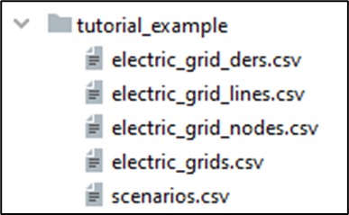
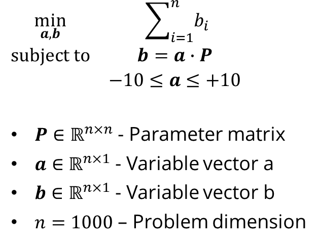

# Examples

## Tutorial 1: Solving a multi-period electric OPF

### Outline

1. Select test case
2. Load data & models
3. Set up OPF problem
4. Solve problem & get results
5. Plot some results

### Imports

```python
import os
import plotly.express as px

import mesmo
```
- Running `import mesmo` includes all submodules.

### Settings

```python
scenario_name = 'singapore_6node'
results_path = mesmo.utils.get_results_path(__file__, scenario_name)
```
- `scenario_name` serves as general identifier for test case definitions.
- `get_results_path()` creates unique timestamped results_path, i.e., a new folder in `./results/`.

### Loading the data & models

```python
price_data = mesmo.data_interface.PriceData(scenario_name)
linear_electric_grid_model_set = mesmo.electric_grid_models.LinearElectricGridModelSet(scenario_name)
der_model_set = mesmo.der_models.DERModelSet(scenario_name)
```
- Data & model classes are structured into thematic submodules and objects can generally be instantiated for the current test case by simply passing `scenario_name`.
- Data & model objects are essentially containers for numerical parameters.

### Defining the optimization problem

```python
optimization_problem = mesmo.utils.OptimizationProblem()
```
- `optimization_problem` serves as container for variables / parameters / constraints / objective of the optimization problem.

```python
linear_electric_grid_model_set.define_optimization_problem(optimization_problem, price_data)
der_model_set.define_optimization_problem(optimization_problem, price_data)
```
- Model objects provide methods for defining variables / parameters / constraints / objective. These definitions are essentially “attached” to `optimization_problem`.
- Additional/custom definitions can be manually added to `optimization_problem`.

### Solving the optimization problem

```python
optimization_problem.solve()
```
- The `solve()` method generates the LP/QP standard form & passes the problem to the solver via solver interface (direct via `gurobipy` or indirect via `cvxpy`).
- Solutions are stored as variable / dual vector within `optimization_problem`.

### Retrieving the results

```python
results = mesmo.problems.Results()
results.update(linear_electric_grid_model_set.get_optimization_results(optimization_problem))
results.update(der_model_set.get_optimization_results(optimization_problem))
results.update(linear_electric_grid_model_set.get_optimization_dlmps(optimization_problem, price_data))
```
- Results can be extracted from `optimization_problem` through methods of the model objects.
- The results object is a container for `pd.DataFrame` and other objects that hold individual variable values.

```python
results.save(results_path)
```
- The `save()` method stores all `pd.DataFrame` objects as CSV files and other object as PKL files. This intended to facilitate separate post-processing of the results.

```python
figure = px.line(results.branch_power_magnitude_vector_1.loc[:, ('line', '1', 1)].rename('Line 1; phase 1'))
mesmo.utils.write_figure_plotly(figure, os.path.join(results_path, 'branch_power_line_1_phase_1'))
```
- `plotly` is recommended for quick plotting and `write_figure_plotly()` is provided for configurable output.
- Always use relative paths and join paths using `os.path.join()`.

## Tutorial 2: Defining a basic electric grid test case

### Outline

1. Define 2-node electric grid test case
   - Node 0: 22 kV, 3-phase
   - Node 1: 22 kV, 3-phase
   - Line 1: Node 0 -> Node 1, 3-phase, line type: singapore_cable_22_copper_300, length: 0.5
   - DER 1: Fixed load, model_name: mixed_commercial_residential
   - DER 2: Flexible load, model_name: mixed_commercial_residential
   - Timestep start: 2017-01-02T00:00:00, timestep end: 2017-01-03T00:00:00, timestep interval: 00:30:00
2. Solve nominal operation problem
3. Add peak shaving constraint 95% of nominal load peak
4. Solve optimal operation problem
5. Make plot for DER demand, comparison nominal vs. optimal


### Test case definition

1. Create new folder in `./data` directory for the test case.
2. Create new set of CSV files.
   - CSV file templates can be copied from the `./data/templates/` directory.
   - CSV files can be based off existing test cases, e.g., `./data/test_case_examples/singapore_6node/`.



### Imports and settings

```python
import numpy as np
import os
import plotly.graph_objects as go

import mesmo
```

```python
scenario_name = 'tutorial_example'
results_path = mesmo.utils.get_results_path(__file__, scenario_name)
```
- Select the scenario according to the new test case definition.

### Recreate database

```python
mesmo.data_interface.recreate_database()
```
- The CSV files serve as the input format, but an SQLITE database is used internally for data processing.
- Therefore, changes in the CSV files need to read into the SQLITE database through the recreate_database() command

### Get problem objects

```python
problem_nominal = mesmo.problems.NominalOperationProblem(scenario_name)
problem_optimal = mesmo.problems.OptimalOperationProblem(scenario_name)
```

- The nominal operation problem represents a simulation under „nominal conditions“, i.e., all DERs are dispatched according to their nominal power timeseries.
- The optimal operation problem represents an optimization for optimal dispatch decisions, subject to the constraints of the DERs, electric grid and thermal grid.
- The problem classes implement the appropriate setup routines depending on the test case definition, e.g., thermal grid model is only loaded if a thermal grid is defined.

### Solve nominal operation problem and get results

```python
problem_nominal.solve()
results_nominal = problem_nominal.get_results()
```

- The `solve()` method of the nominal operation problem invokes the power flow solution classes of electric and thermal grid for non-linear simulation.
- The `get_results()` methods obtains results from the individual models and resturn a `Results` object.

### Customize and solve optimal operation problem

```python
for timestep in problem_optimal.timesteps:
    problem_optimal.optimization_problem.define_constraint(
        (
            'variable',
            np.array([np.real(problem_optimal.electric_grid_model.der_power_vector_reference)]),
            dict(name='der_active_power_vector', timestep=timestep)
        ),
        '>=',
        (
            'constant',
            0.95 * np.min(np.sum(results_nominal.der_active_power_vector, axis=1))
        )
    )
```
- (More explaination follows in tutorial 3.)

```python
problem_optimal.solve()
results_optimal = problem_optimal.get_results()
```
- The `solve()` method of the optimal operation problem invokes the `solve()` method of the optimization problem (more explanation in tutorial 3).
- The `get_results()` methods obtains results from the individual models and returns a `Results` object.

### Plotting and wrapping things up

```python
figure = go.Figure()
figure.add_trace(go.Scatter(
    x=results_nominal.der_active_power_vector.index,
    y=np.abs(np.sum(results_nominal.der_active_power_vector, axis=1)),
    name='Nominal',
    line=go.scatter.Line(shape='hv')
))
figure.add_trace(go.Scatter(
    x=results_optimal.der_active_power_vector.index,
    y=np.abs(np.sum(results_optimal.der_active_power_vector, axis=1)),
    name='Optimal',
    line=go.scatter.Line(shape='hv')
))
mesmo.utils.write_figure_plotly(figure, os.path.join(results_path, 'comparison'))
```
- Note that `plotly` can be used either via `plotly.express` or `plotly.graph_objects` interface (compare with tutorial 1).

```python
mesmo.utils.launch(results_path)
print(f"Results are stored in: {results_path}")
```
- The `launch()` function opens a file explorer / finder window for the given path.

## Tutorial 3: Using the optimization problem interface

### Outline

This tutorial implements the following optimization problem through the MESMO optimization problem interface:



### Imports

```python
import numpy as np

import mesmo
```

### Define random parameter matrix

```python
dimension = 1000
parameter_matrix = np.random.rand(dimension, dimension)
```
- Accepted numerical values for parameter, constraint or variable definitions are 1) float values, 2) numpy arrays or 3) scipy sparse matrices.

### Instantiate optimization problem object

```python
optimization_problem = mesmo.utils.OptimizationProblem()
```
- The optimization problem object serves as a container for the parameters, variables, constraints and objective terms.
- The optimization problem objects exposes methods for problem setup & solution, which utilized in the following.

### Define parameters

```python
optimization_problem.define_parameter('parameter_matrix', parameter_matrix)
```
- Defining parameters is optional. – Numerical values can also be directly passed in the constraints / objective definitions. However, using parameters allows updating the numerical values of the problem without re-defining the complete problem.

### Define variables

```python
optimization_problem.define_variable('a_vector', a_index=range(dimension))
optimization_problem.define_variable('b_vector', b_index=range(dimension))
```
- Variables are defined by passing a name string and index key sets. The variable dimension is determined by the dimension of the index key sets. Accepted key set values are 1) lists, 2) tuples, 3) numpy arrays, 4) pandas index objects and 5) range objects.
- If multiple index key sets are passed, the variable dimension is determined as the cartesian product of the key sets. However, note that variables always take the shape of column vectors in constraint and objective definitions. That means, multiple key sets are not interpreted as array dimensions.

### Define constraints

```python
optimization_problem.define_constraint(
    ('variable', 1.0, dict(name='b_vector')),
    '==',
    ('variable', 'parameter_matrix', dict(name='a_vector')),
)
optimization_problem.define_constraint(
    ('constant', -10.0),
    '<=',
    ('variable', 1.0, dict(name='a_vector')),
)
optimization_problem.define_constraint(
    ('constant', +10.0),
    '>=',
    ('variable', 1.0, dict(name='a_vector')),
)
```
- Constraints are defined as list of tuples and strings, where tuples are either 1) variable terms or 2) constant terms and strings represent operators (==, <= or >=). If multiple variable and constant terms are on either side of the operator, these are interpreted as summation of the variables / constants.
- Constant terms are tuples in the form (‘constant’, numerical value), where the numerical value can be 1) float value, 2) numpy array, 3) scipy sparse matrix or 4) a parameter name string. The numerical value is expected to represent a column vector with appropriate size matching the constraint dimension. If a float value is given as numerical value, the value is multiplied with a column vector of ones of appropriate size.
- Variable terms are tuples in the form (‘variable’, numerical factor, dict(name=variable name, keys…)), where the numerical factor can be 1) float value, 2) numpy array, 3) scipy sparse matrix or 4) a parameter name string. The numerical factor is multiplied with the variable vector and is expected to represent a matrix of appropriate size for the multiplication. If a float value is given as numerical factor, the value is multiplied with a identity matrix of appropriate size. Keys can be optionally given to select / slice a portion of the variable vector. Note that variables always take the shape of column vectors.

### Define objective terms

```python
optimization_problem.define_objective(('variable', 1.0, dict(name='b_vector')))
```
- Objective terms are defined as list of tuples, where tuples are either 1) variable terms or 2) constant terms. Each term is expected to evaluate to a scalar value. If multiple variable and constant terms are defined, these are interpreted as summation of the variables / constants.
- Constant terms are tuples in the form (‘constant’, numerical value), where the numerical value can be 1) float value or 2) a parameter name string.
- Variable terms are tuples in the form (‘variable’, numerical factor, dict(name=variable name, keys…)), where the numerical factor can be 1) float value, 2) numpy array, 3) scipy sparse matrix or 4) a parameter name string. The numerical factor is multiplied with the variable vector and is expected to represent a matrix of appropriate size for the multiplication, such that the multiplication evaluates to a scalar. If a float value is given as numerical factor, the value is multiplied with a row vector of ones of appropriate size. Keys can be optionally given to select / slice a portion of the variable vector. Note that variables always take the shape of column vectors.

### Solve problem and obtain results

```python
optimization_problem.solve()
```
- Calling the solve() method compiles the standard form of the linear program and passes it the optimization solver, e.g. Gurobi.
- The solve method currently implements interfaces to 1) Gurobi and 2) CVXPY, where the latter is a high-level convex optimization interface, which in turn allows interfacing further third-party solvers. The intention is to implement more direct solver interfaces on a as-need basis (please raise an issue!), as these interfaces are assumed to allow higher performance than CVXPY for large-scale problems. However, CVXPY is kept as a fallback to allow a high degree of compatibility with various solvers.

```python
results = optimization_problem.get_results()
a_vector = results['a_vector']
b_vector = results['b_vector']
```
- Results are returned as dictionary with keys corresponding to the variable names that have been defined.

## More examples

The `examples` directory contains following run scripts which demonstrate the usage of different MESMO features.

### API examples

These examples demonstrate the usage of the high-level API to execute predefined problem types.

- `run_api_nominal_operation_problem.py`: Example script for setting up and solving an nominal operation problem. The nominal operation problem (alias: power flow problem, electric grid simulation problem) formulates the steady-state power flow problem for all timesteps of the given scenario subject to the nominal operation schedule of all DERs.
- `run_api_optimal_operation_problem.py`: Example script for setting up and solving an optimal operation problem. The optimal operation problem (alias: optimal dispatch problem, optimal power flow problem) formulates the optimization problem for minimizing the objective functions of DERs and grid operators subject to the model constraints of all DERs and grids.

### Advanced examples

For advanced usage of MESMO, the following examples demonstrate in a step-by-step manner how energy system models and optimization problems can be defined and solved with MESMO. These example scripts serve as a reference for setting up custom work flows.

- `run_electric_grid_optimal_operation.py`: Example script for setting up and solving an electric grid optimal operation problem.
- `run_thermal_grid_optimal_operation.py`: Example script for setting up and solving a thermal grid optimal operation problem.
- `run_multi_grid_optimal_operation.py`: Example script for setting up and solving a multi-grid optimal operation problem.
- `run_flexible_der_optimal_operation.py`: Example script for setting up and solving a flexible DER optimal operation problem.
- `run_electric_grid_power_flow_single_step.py`: Example script for setting up and solving an single step electric grid power flow problem.

### Validation scripts

Since the model implementations in MESMO are not infallible, these validation scripts are provided for model testing.

- `validation_electric_grid_power_flow.py`: Example script for testing / validating the electric grid power flow solution.
- `validation_linear_electric_grid_model.py`: Example script for testing / validating the linear electric grid model.
- `validation_electric_grid_dlmp_solution.py`: Validation script for solving a decentralized DER operation problem based on DLMPs from the centralized problem.

### Other scripts

- The directory `examples/development` contains example scripts which are under development and scripts related to the development of new features for MESMO.
- The directory `examples/publications` contains scripts related to publications which based on MESMO.
