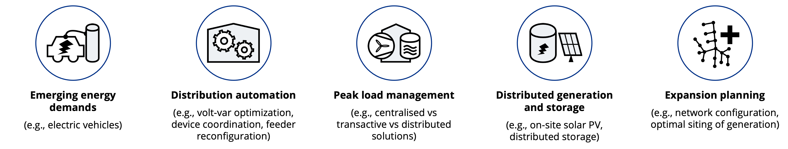

[](https://zenodo.org/badge/latestdoi/201130660)
[](https://github.com/mesmo-dev/mesmo/releases)
[](https://github.com/mesmo-dev/mesmo/commits/develop)
[](https://github.com/mesmo-dev/mesmo/actions/workflows/pythontests.yml?query=branch%3Adevelop)

```{important}
Work in progress: The repository is under active development and interfaces may change without notice. Please use [GitHub issues](https://github.com/mesmo-dev/mesmo/issues) for raising problems, questions, comments and feedback.
```

# What is MESMO?

MESMO stand for "Multi-Energy System Modeling and Optimization" and is an open-source Python tool for the modeling, simulation and optimization of multi-scale electric and thermal distribution systems along with distributed energy resources (DERs), such as flexible building loads, electric vehicle (EV) chargers, distributed generators (DGs) and energy storage systems (ESS).

## Features

MESMO implements 1) non-linear models for simulation-based analysis and 2) convex models for optimization-based analysis of electric grids, thermal grids and DERs. Through high-level interfaces, MESMO enables modeling operation problems for both traditional scenario-based simulation as well as optimization-based decision support. An emphasis of MESMO is on the modeling of multi-energy systems, i.e. the coupling of multi-commodity and multi-scale energy systems.

1. **Electric grid modeling**
    - Simulation: Non-linear modeling of steady-state nodal voltage / branch flows / losses, for multi-phase / unbalanced AC networks.
    - Optimization: Linear approximate modeling via global or local approximation, for multi-phase / unbalanced AC networks.
2. **Thermal grid modeling**
    - Simulation: Non-linear modeling of steady-state nodal pressure head / branch flow / pump losses, for radial district heating / cooling systems.
    - Optimization: Linear approximate modeling via global or local approximation, for radial district heating / cooling systems.
3. **Distributed energy resource (DER) modeling**
    - Simulation & optimization: Time series models for non-dispatchable / fixed DERs.
    - Optimization: Linear state-space models for dispatchable / flexible DERs.
    - Currently implemented DER models: Conventional fixed loads, generic flexible loads, flexible thermal building loads, non-dispatchable generators, controllable electric / thermal generators, electric / thermal energy storage systems, combined heat-and-power plants.
4. **Solution interfaces**
    - Simulation: Solution of non-linear power flow problems for electric / thermal grids.
    - Optimization: Solution of convex optimization problems for electric / thermal grids and DERs, through third-party numerical optimization solvers.
    - Generic optimization problem interface: Supports defining custom constraints and objective terms to augment the built-in models. Enables retrieving duals / DLMPs for the study of decentralized / distributed control architectures for energy systems.
    - High-level problem interfaces: Nominal operation problem for simulation-based studies; Optimal operation problem for optimization-based studies.

## Use cases

District-scale energy systems are evolving from unidirectional, top-down structures into bidirectional, distributed and multi-commodity systems. Furthermore, the increased coupling of electric, thermal and other energy systems in terms of multi-energy systems enables additional flexibility across conventional system boundaries. MESMO is intended to support the various studies that are motivated by these recent developments for district-scale energy systems, such as the examples highlighted below:



1. **Emerging energy demands**: What is the impact of EV charging deployment on distribution system operation?
2. **Distribution automation**: How can the distribution system operator address imminent operational issues?
3. **Peak load management**: Are transactive energy mechanisms suited to increase participation of DERs in maintaining distribution system reliability?
4. **Distributed generation and storage**: Can energy storage systems help mitigate adverse impacts of large-scale solar PV deployment?
5. **Expansion planning**: What are optimal investment decisions for distribution system upgrades?

## Acknowledgements

- MESMO is developed in collaboration between [TUMCREATE](https://www.tum-create.edu.sg/), the [Institute for High Performance Computing, A*STAR](https://www.a-star.edu.sg/ihpc) and the [Chair of Renewable and Sustainable Energy Systems, TUM](https://www.ei.tum.de/en/ens/).
- Sebastian Troitzsch implemented the initial version of MESMO and maintains this repository.
- Sarmad Hanif and Kai Zhang developed the underlying electric grid modeling, fixed-point power flow solution and electric grid approximation methodologies.
- Arif Ahmed implemented the implicit Z-bus power flow solution method & overhead line type definitions.
- Mischa Grussmann developed the thermal grid modeling and approximation methodologies.
- Verena Kleinschmidt implemented several multi-energy DER models, such as the heating plant and CHP plant models.
- Sebastian Troitzsch and Tom Schelo implemented the optimization problem class.
- This work was financially supported by the Singapore National Research Foundation under its Campus for Research Excellence And Technological Enterprise (CREATE) programme.

```{toctree}
:caption: User guide
:hidden:

installation
examples
architecture
```

```{toctree}
:caption: Reference
:hidden:

data_reference
api_reference
configuration_reference
```

```{toctree}
:caption: About
:hidden:

contributing
change_log
publications
License <https://github.com/mesmo-dev/mesmo/blob/develop/LICENSE>
GitHub repository <https://github.com/mesmo-dev/mesmo>
```
